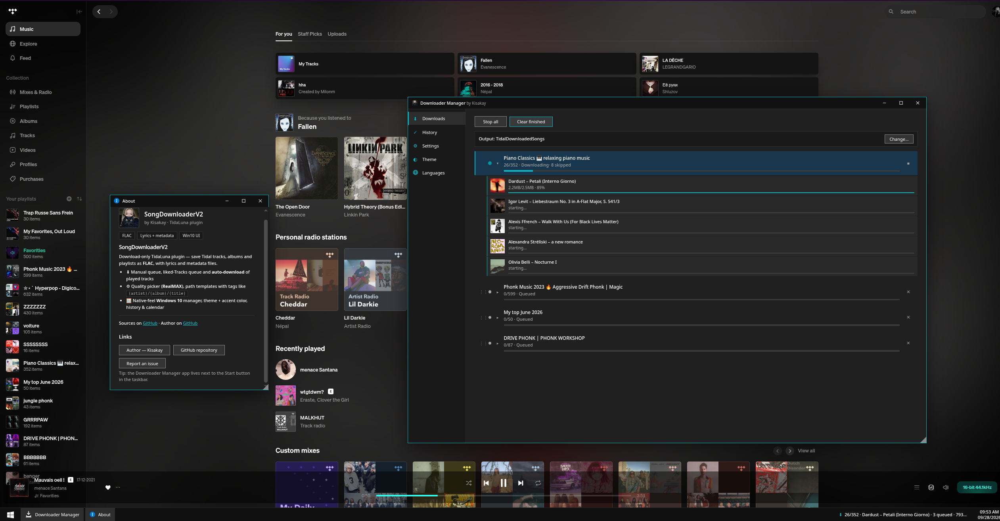
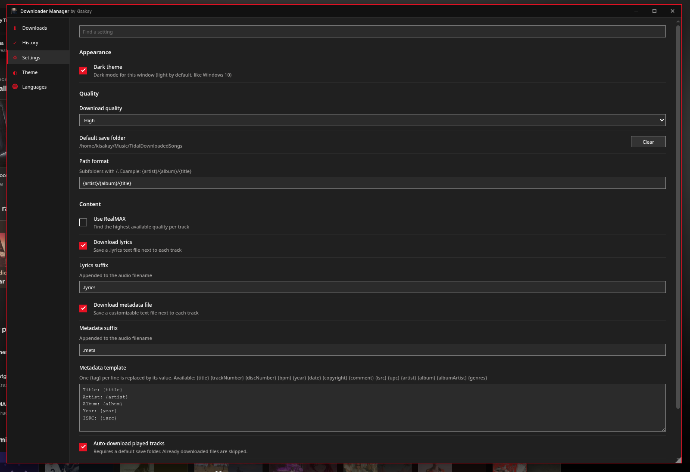
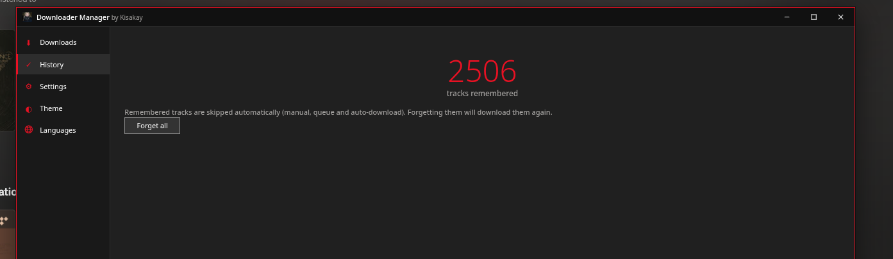

# DownloadManager

Advanced download manager for [TidaLuna](https://github.com/Inrixia/TidaLuna) (TIDAL client mod) by [Kisakay](https://github.com/Kisakay).

Download tracks, albums, playlists and liked **Tracks** as FLAC, with a download queue, lyrics and metadata sidecars, auto-download and a Windows 10 style manager — powered by [winml](https://github.com/Kisakay/winml), the standalone Win10 HUD framework (also [on npm as win10ml](https://www.npmjs.com/package/win10ml)).

## Install

1. Install the [TidaLuna Client](https://github.com/Inrixia/TidaLuna)
2. Open **Luna Settings → Plugin Store → Install from URL** and paste:
   ```
   https://github.com/Kisakay/luna-plugins/releases/download/latest/store.json
   ```
3. Install **DownloadManager** (disable the stock Song Downloader to avoid duplicates).

## Features

- Liked **Tracks**, albums, playlists and single tracks as FLAC (Max quality, RealMAX lookup)
- Download queue: reorder by drag & drop, per-item cancel, 5 concurrent workers with lookahead prefetch, per-track retry with backoff (a single timeout never kills the queue)
- `.lyrics` text file and customizable `.meta` file next to each track (`{tags}` templates)
- Auto-download of every played track (playback watcher with live taskbar status)
- Persistent download history with auto-skip (on-disk check included)
- Windows 10 desktop HUD: Downloader Manager window + About window, taskbar apps with accent underline, live status, clock and calendar
- Win10 MessageBox confirm before closing the manager mid-download (official system icons)
- 5 interface languages (English, 中文, Русский, 日本語, Español) with auto-detection, switchable live in the **Languages** section
- Light/dark theme, custom accent color, draggable/resizable/persisted windows
- Context menus: track rows, sidebar, Tracks page header, right-click on sidebar Tracks entry, right-click on jobs

## Guide

Full overview: Downloader Manager downloading, About window, and both apps pinned in the taskbar:



Settings (quality, folders, lyrics, metadata, auto-download, appearance):



History of remembered tracks (auto-skipped):


