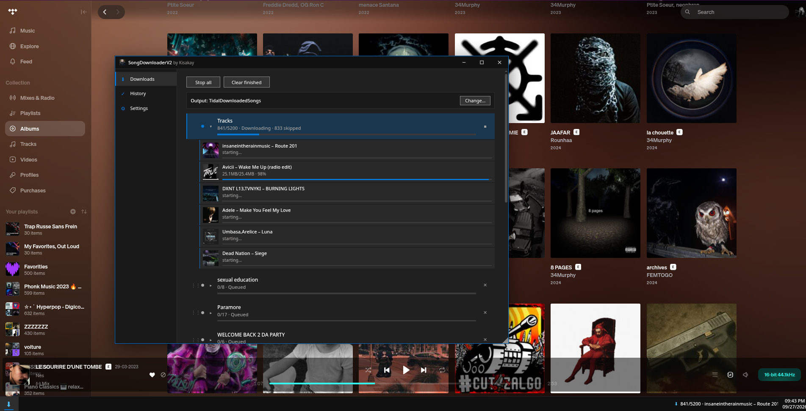

# SongDownloaderV2

Advanced download manager for [TidaLuna](https://github.com/Inrixia/TidaLuna) (TIDAL client mod) by [Kisakay](https://github.com/Kisakay).

Download tracks, albums, playlists and liked **Tracks** as FLAC, with a download queue, lyrics and metadata sidecars, auto-download and a Windows 10 style manager.

## Install

1. Install the [TidaLuna Client](https://github.com/Inrixia/TidaLuna)
2. Open **Luna Settings → Plugin Store → Install from URL** and paste:
   ```
   https://github.com/Kisakay/luna-plugins/releases/download/latest/store.json
   ```
3. Install **SongDownloaderV2** (disable the stock Song Downloader to avoid duplicates).

## Features

- Liked **Tracks**, albums, playlists and single tracks as FLAC (Max quality, RealMAX lookup)
- Download queue: reorder by drag & drop, per-item cancel, 5 concurrent workers with lookahead prefetch
- `.lyrics` text file and customizable `.meta` file next to each track (`{tags}` templates)
- Auto-download of every played track (playback watcher)
- Persistent download history with auto-skip (on-disk check included)
- Manager window, Windows 10 style: light/dark theme, draggable, resizable, taskbar app with live status and calendar
- Context menus: track rows, sidebar, Tracks page header, right-click on sidebar Tracks entry

## Guide

Downloads queue with live tracks, and the taskbar:



Settings (quality, folders, lyrics, metadata, auto-download, appearance):


History of remembered tracks (auto-skipped):


